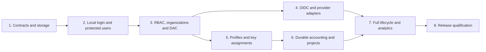

# Local Authentication, Enterprise SSO and Governance Implementation Plan

> **For agentic workers:** Use `superpowers:executing-plans` to implement this plan task by task. If the user chooses delegated execution, use `superpowers:subagent-driven-development`. Steps use checkboxes for tracking. This document plans the work; it does not authorize starting implementation.

**Goal:** Implement OSS-native multi-user email/password authentication, OIDC SSO with the seven requested provider integrations, and the users, organization, RBAC, DAC, access-profile, project, virtual-key, audit and analytics features in the supplied brief.

**Architecture:** Extend existing sessions, config-store migrations, query scopes and grant/permit machinery. Keep authentication, administrative authorization, inference access and accounting separate, with one canonical user identity shared by local and external credentials. Deliver protected vertical slices; do not expose multi-user functionality before its backend authorization works.

**Tech stack:** Go 1.27.0, existing multi-module layout, GORM, SQLite/PostgreSQL config stores, FastHTTP transport, React/Vite/TypeScript, TanStack Router, RTK Query, existing Radix components, Playwright. Reuse `golang.org/x/crypto` and `golang.org/x/oauth2`; select and pin a maintained OIDC verifier during the OIDC dependency task.

**Spec:** [User-provided feature brief](../specs/2026-09-14-identity-governance-user-brief.md). The compatibility corrections and explicit decisions below take precedence over the brief's illustrative implementation details. They are proposed decisions for review, not claims that these features already work.

**Repository baseline:** `ba430a2b0`, inspected 2026-09-14. Only planning documents are created by this task. Recheck the baseline before execution.

## Global constraints

- Use the existing OSS extension points; do not depend on code from the separate Enterprise repository or switch on license flags to simulate implementation.
- `transports/config.schema.json` is the configuration source of truth. Change schema before corresponding Go config, handlers and examples.
- Go modules require **Go 1.27.0**. This checkout has no generated `go.work`; create it at execution time with `make setup-workspace`, which includes the CLI and all plugin modules. Do not commit generated workspace files. Run `go mod tidy` only in a changed module.
- New Go filenames have no underscores except `_test.go`. Extend existing topical tests; create a matching test file only for a new source file without one.
- Preserve existing hook order, immutable grant replacement, provider/model matcher behavior, nil-versus-empty access semantics and pooled-object resets.
- Context holds small identity values or existing manager/grant handles. Growing claim collections, policy explanations, accounting reservations and stream data belong in bounded managers or durable stores.
- Backend permissions and scoped queries are authoritative. UI hiding alone never authorizes access.
- Use existing entity selectors, form components, `react-hook-form`, Zod v4 and stable `data-testid` attributes. Keep routes in `layout.tsx` and composition in `page.tsx`.
- Preserve literal field order in Playwright request payloads. Import fixtures from `tests/e2e/core/fixtures/base.fixture`, with the correct relative path.
- No public self-registration, SMTP recovery, SAML, full inbound SCIM server, new clustering product, or implementation of unrelated Enterprise-only features is included. Named-provider directory synchronization and lifecycle reconciliation **are** included.
- Add an audit record and a configuration/OpenAPI update with each security-sensitive feature, rather than postponing them to a final hardening phase.

## 1. What already exists, and what changes

| Area | Verified repository baseline | Planned work |
|---|---|---|
| Local login | `transports/bifrost-http/handlers/session.go` checks one configured username and bcrypt password; issues a 30-day opaque cookie | Add canonical users, local credentials, recovery and configurable sessions |
| Session persistence | `framework/configstore/tables/sessions.go` already has `TokenHash`, optional token encryption and hash lookup with a plaintext fallback in `rdb.go` | Add user binding and revocation; migrate to digest-only storage after compatibility consumers have moved |
| Auth configuration | `framework/configstore/clientconfig.go` uses `is_enabled`, `admin_username`, `admin_password`; preferred schema location is `governance.auth_config` | Extend that contract; do not introduce a competing top-level `enabled` switch |
| Request identity/access | `core/schemas/grant.go`, `framework/grant/`, and `transports/bifrost-http/lib/grant.go` provide identity, permit, access and limits abstractions | Add canonical-user resolution and new permit sources through those abstractions |
| Governance | `plugins/governance/{main,store,resolver,tracker}.go` already check/charge lists of limits; user-governance methods include OSS stubs | Replace the stubs and supply resolved holders; avoid a second policy engine |
| DAC | `framework/queryscope/queryscope.go` and both stores' `ScopedDB` exist, including dimension scoping | Build permission-aware scopes and cover every protected query; absent scope currently means unrestricted |
| Projects | Schema, docs, header constants, grant composition and log-dimension tests exist | Implement OSS persistence, request resolution, management UI and complete accounting |
| UI | Login and governance routes import `@enterprise` views; fallback RBAC permits everything | Introduce working shared OSS implementations and permission-aware contexts while preserving optional extension hooks |
| Logging | `framework/logstore/tables.go`, `rdb.go`, `matviews.go` and `projectdimension_test.go` already support parts of identity/project reporting | Fill gaps, including scoped rankings and supported alternate log-store implementations |
| Schema versus runtime | Schema already describes business units, roles, access profiles, projects and `scim_config`, while OSS Go config lacks several runtime types | Implement and reconcile the existing contracts; distinguish a documented schema field from implemented OSS behavior |

### Corrections to the supplied brief

1. **Project wire values:** keep `access_rule: intersect | union`, `accounting_mode: both | project_only | principal_only`, and `is_active`. “Restrict,” “Extend,” and “User only” are display labels.
2. **Project header precedence:** preserve documented behavior: a present `x-bf-project-id` wins over name, including an empty ID. An empty or invalid selected ID fails; it does not fall through to name or unscoped execution.
3. **Grant composition:** existing caller permits union their grants. Mandatory platform/organization constraints intersect with that result. Intersecting every access profile would change the current grant contract and make additive profiles unexpectedly remove access.
4. **Account linking:** verified email alone is insufficient for automatic linking. Default to explicit linking after fresh proof of control of the existing account, or a separately authorized administrator operation. Use validated issuer and subject for returning logins.
5. **Usage accounting:** charge each physical attempt that consumes billable usage, even if it fails or a fallback succeeds. Deduplicate settlement for the same attempt, rather than charging only the final successful response.
6. **No blanket identity from shared keys:** assignment of one key to several users does not prove which user sent a request. Shared keys retain service/key attribution unless an independent user credential is verified.
7. **Migration and basic authorization move forward:** ship both with the first multi-user release. Do not postpone compatibility to the last milestone.
8. **Metrics:** avoid unconditional user/email/project labels on Prometheus metrics. Keep high-cardinality dimensions in scoped logs/analytics and spans; any metric-label expansion requires an explicit bounded configuration.

## 2. Architecture decisions

### Approach selection

| Approach | Benefits | Trade-off | Decision |
|---|---|---|---|
| Extend existing OSS identity/grant/store boundaries | Reuses SDK, transport and logging contracts; supports all requested login methods | Requires careful migration and route coverage | Recommended |
| Put an external authentication proxy in front | Faster SSO-only entry point | Does not deliver local users, DAC, profiles, projects or trustworthy per-user key attribution | Useful deployment alternative, insufficient for this scope |
| Build a parallel identity/governance plugin and JWT stack | Initially isolates new code | Duplicates sessions, policy checks and accounting; leaves existing callers inconsistent | Do not use |

### Canonical identity and credential boundaries

- `User` is the canonical person. Local credentials and external identities reference its stable ID. Roles, memberships, projects, profiles and audit events reference the same ID.
- A deployment is one administrative boundary. Customers are governance entities, not independent authentication tenants in this version.
- Local login uses trimmed, case-normalized email for matching; preserve display email. Do not strip `+tags`, dots or provider-specific aliases. Email changes require reauthentication or an audited administrator action and must pass uniqueness checks.
- Maintain a separate `legacy_username` mapping for imported admins whose name is not an email. Do not invent an email address or claim it was verified. Let that admin set an email during a limited migration flow after successful legacy authentication.
- Reject new OIDC JIT provisioning without a trustworthy, unique email by default. Existing issuer/subject bindings can survive missing email claims or a changed email; a claim change never silently merges users.
- Session, Bifrost API key, virtual key, MCP-issued credential and unauthenticated legacy mode remain distinct credential kinds. Management APIs accept a credential only if it maps to a supported permission-bearing principal. Existing privileged API-key behavior must be inventoried and explicitly mapped; a bare “API key authenticated” flag must not bypass new RBAC.
- When credentials are combined, preserve existing explicit virtual-key precedence and require any accompanying user binding to be verified. Never populate identity from caller-controlled `x-user-*` headers.
- Keep current intentionally unauthenticated deployment behavior when multi-user mode is disabled. Enabling multi-user mode requires authentication and cannot silently fall back to the local-admin bypass on a store error.

### Local authentication and sessions

- Local, SSO-only and mixed modes are supported. Local self-registration remains off. Admin creation issues a single-use enrollment/reset token shown once to the operator; no email-delivery claim is made.
- Use 32 random bytes for new opaque session tokens; persist only the SHA-256 digest after migration. Extend the current integer session ID rather than changing its primary-key type.
- Proposed defaults: 12-hour absolute session lifetime, 30-minute idle timeout, 5-minute OIDC transaction lifetime, 30-minute enrollment/reset token lifetime. Store times in UTC and test with an injected clock.
- Password policy: 15-character minimum for password-only login, support long passphrases up to 128 Unicode code points with a 1 KiB byte bound, no composition rules, common-password blocklist and no silent truncation. Preserve existing bcrypt verification limits for legacy credentials until reset or successful upgrade.
- Add Argon2id with versioned PHC encoding; initial tunable parameters of 64 MiB, three iterations and one lane. Benchmark the deployment target; enforce a bounded hash-worker pool, parameter upper bounds and account/IP throttling. These are proposed settings above the [OWASP minimum](https://cheatsheetseries.owasp.org/cheatsheets/Password_Storage_Cheat_Sheet.html), not measured performance results.
- Password changes/reset revoke existing sessions transactionally. Password-reset-only sessions may access only completion/logout routes. Never return hashes or raw tokens through list/detail DTOs.
- Use one cookie builder: HTTP-only, SameSite Lax, Path `/`; Secure on direct TLS or explicitly trusted proxy TLS. Canonical public URL and trusted-proxy CIDRs determine redirects/protocol; arbitrary forwarded headers do not.
- Protect cookie-authenticated state changes with origin validation and session-bound CSRF tokens. Include login CSRF protections; bearer-only clients use their explicit credentials. Logout is idempotent and still rejects cross-site cookie actions.
- Revocation must be effective on the next protected request, including WebSocket ticket consumption. Revoke/close dashboard sockets on session invalidation; recheck user/access state on later provider attempts and MCP tool execution. Already dispatched provider work cannot be undone and must still settle incurred usage.

### OIDC and provisioning

- Use authorization code with S256 PKCE, state, nonce, exact callback URI and issuer binding. A server-side transaction binds provider ID, browser correlation secret, intended linking user, nonce, verifier and local return path. Consume state once atomically across replicas.
- Validate signature/algorithm, issuer, audience, expiry, nonce and authorized party as applicable; validate UserInfo subject against the ID token. Use a maintained verifier rather than handwritten JWT validation. Follow [OIDC Core](https://openid.net/specs/openid-connect-core-1_0.html) and [OAuth Security BCP](https://www.rfc-editor.org/rfc/rfc9700.html).
- Discovery/JWKS/token/UserInfo/directory clients have timeouts, response-size limits, redirect limits and per-provider network allowlists. Private self-hosted IdPs require explicit trusted CIDRs and valid TLS or a configured CA; do not disable certificate verification globally. Apply SSRF protections at connection time as well as URL validation.
- Public provider discovery returns only enabled IDs, labels and icons. Configuration, verification and sanitized claims-preview APIs require `UserProvisioning` permission and never expose secrets or unrestricted token contents.
- Keep directory synchronization separate from login. Assignments carry source, provider and external object identity. Only a complete successful snapshot can remove source-owned assignments; errors, throttling and incomplete pages cannot deprovision users.
- Provider refresh/status checking runs every 15 minutes when supported; directory reconciliation defaults to 24 hours. Revocation latency is bounded by available provider signals, not magically immediate. An explicit inactive result revokes that provider's login/session access; a transient outage is not deactivation. Existing sessions may continue within their hard expiry, and new login fails clearly.
- For users with several identity sources, disabling one IdP identity revokes that provider's sessions and assignments. Explicit local suspension disables every login and user-owned key. A directory-managed user with no remaining active source is disabled; a manually managed local account is not erased by unrelated sync.
- Local logout always revokes the Bifrost session. IdP logout is optional and separately configured. Retain encrypted refresh tokens only when lifecycle/session policy needs them; handle rotation atomically and never expose them to the browser.

### RBAC and DAC

- Define permissions as `(resource, operation, scope)`. Union grants only for the **same resource and operation**, taking the union of their visible row sets. An unrelated all-data permission must never widen an own-data permission on another operation.
- Reuse existing resource names and operations (`ModelProvider`, `Settings`, `RBAC`, `Read`, `View`, `Reveal`, etc.). Add `Assign`/`Execute` only where needed and generated into every API/UI contract; do not rename existing values from the brief's examples.
- Seed immutable `super_admin` plus documented Admin/Developer/Viewer templates and the brief's security/governance/operator/auditor/user templates with explicit permission rows. Only `super_admin` is a permanent bypass. Other system roles are nondeletable but editable where the existing contract permits; upgrades never overwrite administrator edits.
- Initial `user` has own-data visibility and no inference grant until assigned access. Administrative capability does not automatically grant model/provider access.
- Protect assignment and role editing against privilege escalation: actors need assignment authority and cannot grant permissions/scopes beyond their delegable authority. Super-admin assignment is super-admin-only and requires fresh authentication.
- Serialize checks that would remove the last active super-admin or its final usable login method, including provider disable, bulk sync, config reload and concurrent requests.
- DAC supports own-data, team-data and all-data, plus per-resource overrides. Own usually means creator/owner; user profiles mean the same user; inference logs mean attributed user; projects additionally allow membership. Document ownership for each resource in a route manifest.
- Team-data includes own rows and current eligible teammates; no teams means own-data. Global resources without meaningful row ownership require a resource-wide grant. Legacy unattributed rows are all-data-only until an explicit audited ownership migration.
- Apply scopes to SQL before pagination, counting, aggregation, search and export. Apply `DimensionScope` separately so a visible multi-team row cannot reveal an invisible customer/team in rankings or filters. Do not change the global nil-scope convention used by internal jobs; authenticated boundaries must install a scope or reject the request.

### Organization and policy resolution

- Preserve `TableTeam.CustomerID` and existing virtual-key ownership fields. Add business units and sourced user/team memberships without forcing existing teams through a destructive hierarchy migration.
- Represent the organization as an acyclic graph: users can join multiple teams and BUs; teams can join multiple BUs; a BU belongs to at most one customer initially. Existing team/customer relationships remain valid. Deduplicate ancestor IDs and counter IDs reached by several paths.
- Additive user/profile grants union using `framework/grant.Access`. Explicit mandatory organization/platform restrictions intersect after that union. A deny in one additive permit limits that permit; a mandatory deny blocks the final result. Keep these policy kinds explicit in configuration and the explanation UI.
- Disabled additive profiles contribute no grant. A disabled mandatory policy or suspended user fails closed. An explicitly presented expired/disabled key is rejected, not silently replaced with some other permission.
- All applicable selected ledgers enforce limits; accounting modes select ledgers before admission. Access restrictions still apply even when a project's accounting mode excludes an organizational ledger.
- Profiles are native permit sources. Where automatic external-client access is requested, create one managed user/profile virtual-key handle referencing the profile, not cloned policy. Assignment removal revokes that binding. Existing grants update without rewriting thousands of provider/model rows.

### Projects and accounting

| Mode | Caller hierarchy | Project/member caps | Deployment global caps |
|---|---|---|---|
| `both` | Enforce and charge | Enforce and charge | Always |
| `project_only` | Not consulted for limits | Enforce and charge | Always |
| `principal_only` | Enforce and charge | Not consulted for limits | Always |

- Project access composes across providers, models, key IDs and MCP tools with `intersect` or `union`. Empty intersect denies all; empty union adds nothing. Unknown modes fail closed. Platform restrictions always cap the result.
- Explicit projects require a verified member user. Open projects admit supported authenticated service/key principals too. A legacy shared key does not become a user because several people are assigned to it.
- Split `equal` requires an explicit, nonempty roster and applies at project/provider/model tiers. Use fixed-precision money and whole token/request units; reject limits that allocate zero units per member. A member share is an additional cap, not a replacement for the total.
- Recompute splits with a versioned job and atomically publish a complete generation. Hold new admissions for affected project limits while a changed roster/cap generation is pending; preserve already admitted attempt snapshots for settlement. Removing a member takes effect immediately for new access.
- Under `none`, allow explicit per-member amount/percentage caps. Under `equal`, reject manual caps; require an explicit destructive-policy-change field when replacing existing manual caps, with a UI preview. Preserve accumulated usage across redivision.
- Reuse existing calendar/fiscal budget-window behavior and cycle IDs. Specify UTC as the initial calendar timezone; moving to a new cycle never redirects late settlement into the wrong cycle.
- Introduce durable reservations and a usage ledger before promising atomic multi-ledger accounting. Reservation keys use a server-generated request ID, physical attempt number and cycle; settlement uniqueness includes the accounting target. Caller-supplied request IDs alone must not deduplicate unrelated traffic.
- Reserve all selected targets in one config-store transaction using deterministic row-lock order (PostgreSQL) or a bounded serialized write transaction (SQLite). Recheck authoritative balances under lock. Deduplicate targets reached through multiple memberships.
- Reserve bounded expected maximum usage when available; for unknown-cost operations reserve a documented estimate and report the possibility of final cost exceeding it. A strict “never overspend” mode must reject operations without a safe bound or enforce incremental reservation/cancellation with a documented in-flight allowance.
- Finalize actual usage and release unused reservations in one idempotent transaction. Failed/cancelled attempts with reported usage still bill; pre-dispatch rejection with no usage releases its reservation. Do not roll back real usage just because it exceeds the estimate.
- Once a provider call has happened, database failure cannot fail the external side effect retroactively. Retry settlement durably, show unsettled usage, and block new admissions against uncertain counters rather than logging and forgetting the error. Recover orphaned reservations conservatively; expiry alone is not proof a provider call consumed nothing.
- Batch/async jobs keep durable reservations and settlement identities until final usage; do not expire them on the short synchronous-request timer. Do not claim restart-safe exactly-once charging from the current process-local billed map.

## 3. Delivery order and acceptance gates



| Milestone | Tasks | Independently reviewable exit criterion |
|---|---|---|
| 1. Contracts/storage | 1–4 | Old configuration still loads; additive migration and audit records work on SQLite/PostgreSQL |
| 2. Local multi-user | 5–8 | Two users log in separately; only the bootstrap admin can administer users; disabled users and revoked sessions are rejected |
| 3. Organization/RBAC/DAC | 9–11 | Own/team/all isolation works for CRUD, counts, nested records, exports and aggregates |
| 4. OIDC | 12–15 | Generic and six named providers pass mock contracts; local/SSO/mixed modes work |
| 5. Profiles/keys | 16–18 | User/profile changes affect inference without policy cloning; assigned shared keys do not fabricate user attribution |
| 6. Accounting/projects | 19–21 | Concurrent admissions respect selected caps; restart/replay does not duplicate settlement; project modes match schema |
| 7. Lifecycle/analytics | 22–23 | Sync preserves manual grants; scoped rankings and accounting explain the same requests |
| 8. Qualification | 24 | Migration, auth matrix, security, race, build and representative performance gates pass |

Provider-adapter implementation can overlap profile work after shared contracts stabilize. This is a delivery dependency statement, not an instruction to launch agents.

## 4. Implementation tasks

Each numbered task is a PR-sized deliverable; its checkboxes are the execution order. Extend the named tests with the concrete fixtures/assertions described. Run the failing behavioral test before the change and the same test after it; a compile failure alone is not the red test. Commit only the task's files after its checks pass.

### Task 1 — Freeze contracts and the compatibility matrix

**Modify:** `transports/config.schema.json`, `framework/configstore/clientconfig.go`, `transports/bifrost-http/lib/config.go`, `ui/lib/store/apis/sessionApi.ts`.
**Create:** `docs/development/identity-governance-contracts.md`, `framework/configstore/identityconfig.go` and its matching test file.
**Extend tests:** `framework/configstore/clientconfig_redaction_test.go`, `transports/bifrost-http/lib/config_test.go`; place new identity-config parsing tests in `framework/configstore/identityconfig_test.go` beside its new source file.

- [ ] Define `governance.auth_config.local_login` with `is_enabled`, `session_ttl_seconds`, `idle_timeout_seconds`, and `allow_registration: false`; add multi-provider `oidc_providers` with stable IDs and secret references. Keep old aliases and reject conflicting duplicate definitions.
- [ ] Inventory existing `scim_config`, role, profile and project schema definitions; preserve their wire names/ID types and map supported legacy OIDC settings to the new provider model. Do not silently accept unsupported inbound SCIM behavior in OSS.
- [ ] Write schema/parser fixtures for old admin config, all three new modes, missing usable login method, conflicting aliases, unknown project modes and secret redaction. Add typed feature-capability output so new UI sections appear only when implemented.
- [ ] Document the management/inference credential matrix, permission catalog, resource ownership rules and config ownership semantics described above. Publish endpoint request/response/error examples before handler tasks.
- [ ] Run schema/config tests; commit `docs: define identity and governance compatibility contracts` with the schema/type groundwork.

### Task 2 — Canonical identity and credential persistence

**Create:** `framework/configstore/tables/user.go`, `framework/configstore/tables/credential.go`, `framework/configstore/tables/externalidentity.go`, `framework/configstore/tables/role.go`, `framework/configstore/tables/roleassignment.go`, `framework/configstore/identitystore.go` (interfaces) and `framework/configstore/identity.go` (RDB operations).
**Modify:** `framework/configstore/store.go`, `migrations.go`.
**Tests:** new `framework/configstore/identity_test.go`; extend `framework/configstore/migrations_test.go`.

- [ ] Add users with nullable unique normalized email for migration, status, display name, creator and timestamps; credentials keyed by user; external identities unique on validated `(issuer, subject)` with a provider binding. Do not store passwords in the user row or full token claims in JSON.
- [ ] Add the minimal role and user-role assignment tables needed by bootstrap; seed the immutable super-admin role before Task 4 imports its first user. The complete permission catalog and other role templates arrive in Tasks 7 and 9.
- [ ] Add narrow `UserStore`, `CredentialStore` and `ExternalIdentityStore` interfaces and compose them into the config-store contract. Keep RDB implementations in focused files; adapt existing mocks when the composed interface changes.
- [ ] Use database constraints and transactions for duplicate email, concurrent first-user creation, external identity conflicts and soft-disable. Add auth-version counters for revocation/policy invalidation.
- [ ] Test two transactions racing for the same normalized email and issuer/subject, case normalization, soft-disable retaining historical IDs, and profile DTOs omitting credentials. Run the same suite against SQLite and PostgreSQL.
- [ ] Commit `feat(identity): add canonical users and credential persistence`.

### Task 3 — Audit journal and durable change events

**Create:** `framework/configstore/tables/auditevent.go`, `outboxevent.go`, `framework/configstore/audit.go`, `framework/audit/service.go` with matching tests.
**Modify:** `framework/configstore/migrations.go`, `store.go`.

- [ ] Persist security events with actor principal, target, action, request ID, timestamp and redacted changed fields. Failed login records normalized/HMAC identifier metadata without passwords, tokens or unbounded headers.
- [ ] Store administrative change plus audit event plus cache-invalidation event in one config-store transaction; rollback the mutation if that commit fails. Transport delivery failures after commit remain retryable outbox entries.
- [ ] Add an audit-query API contract scoped by `AuditLogs` permissions, retention settings and indexed pagination. Authentication-failure event delivery must be bounded and must never turn a failed login into a successful one.
- [ ] Test transaction rollback, duplicate outbox delivery, secret redaction, audit pagination isolation and worker recovery after restart.
- [ ] Commit `feat(audit): journal identity and governance changes`.

### Task 4 — Additive session migration and legacy bootstrap

**Modify:** `framework/configstore/tables/sessions.go`, `rdb.go`, `migrations.go`, `encryption.go`, `transports/bifrost-http/handlers/middlewares.go`.
**Create:** `framework/configstore/sessionidentity.go`, `framework/identity/bootstrap.go` with matching tests.
**Extend tests:** `framework/configstore/migrations_test.go`, `rdb_test.go`, `encryption_test.go`, `transports/bifrost-http/handlers/middlewares_test.go`.

- [ ] Add session user ID, method, provider, created/last-seen/absolute/idle expiry, revoked timestamp and auth-version fields while retaining the existing integer primary key.
- [ ] Import configured admin bcrypt hash unchanged into an idempotently created super-admin credential. Resolve existing secret references through existing configuration code; never hash the hash or print the resolved value. Record a migration marker in the same transaction.
- [ ] Handle non-email usernames through the transitional mapping; require authenticated email completion before removing it. Require setup token for an empty deployment and serialize bootstrap so only one initial admin wins.
- [ ] Bind old unowned sessions to the migrated legacy admin only when their provenance is unambiguous; otherwise revoke and require login. Keep a one-release reader bridge, then migrate unique/non-null token-column constraints and encryption hooks for nullable digest-only rows.
- [ ] Test plain/encrypted session databases, absent encryption key failure, repeated startup, multiple replicas, missing legacy email and session expiry. Stop with an actionable error on ambiguous migration; do not start an unprotected server.
- [ ] Commit `feat(identity): migrate legacy admin and session ownership`.

### Task 5 — Password service and limited recovery credentials

**Create:** `framework/identity/password.go`, `recovery.go`, `throttle.go`, `framework/configstore/tables/recoverytoken.go` and matching tests.
**Modify:** `framework/configstore/migrations.go`, `identity.go`; reuse `framework/encrypt/encrypt.go` bcrypt verification without changing unrelated encryption behavior.

- [ ] Implement versioned Argon2id hashing, legacy bcrypt verification and successful-login rehash. Enforce input/hash-parameter bounds before allocating memory and use a fixed maximum number of hash workers.
- [ ] Add per-account and per-trusted-client-IP throttling with bounded TTL state. For multi-replica auth, use a shared admission record so adding replicas does not multiply the guessing allowance. Unknown accounts perform a dummy password verification within the same throttle budget.
- [ ] Issue single-use digest-stored enrollment/reset tokens; consume and update password/session versions transactionally. Store neither reset URL nor token in audit payloads; return the token only in the immediate authorized creation response.
- [ ] Test correct/incorrect/malformed hashes, old-format upgrade, oversized input, reuse/expiry of reset tokens, parallel redemption, generic failure responses and account-lockout abuse recovery.
- [ ] Commit `feat(identity): add password verification and one-time recovery`.

### Task 6 — Session service and trusted request authentication

**Create:** `framework/identity/session.go`, `principal.go`, `transports/bifrost-http/handlers/sessionsecurity.go` with matching tests.
**Modify:** `transports/bifrost-http/handlers/session.go`, `middlewares.go`, `transports/bifrost-http/lib/grant.go`, `server/server.go`.
**Extend tests:** `handlers/middlewares_test.go`, `lib/grant_test.go`; add `handlers/session_test.go` if no session handler test exists at execution time.

- [ ] Implement the canonical interfaces below. `AuthenticateSession` returns a small immutable principal; middleware records only trusted user/credential fields through existing grant conversion helpers.
- [ ] Add login/current-user/change-password/logout-all/session-list/revoke routes; make `/api/session/is-auth-enabled` report available methods and a validated current session, preserving legacy `auth_type` for old clients.
- [ ] Centralize cookie and trusted-proxy handling, CSRF enforcement and maximum body size. Preserve exact public-route matching; never whitelist the entire `/api/auth` or `/api/oauth` namespace.
- [ ] Recheck session/user state at WebSocket ticket consumption, bind tickets to the session and user, and arrange revocation events to close dashboard sockets. Audit invalidation failures without clearing server state only in the browser.
- [ ] Test cookie/bearer auth, forged forwarded headers, login/state-change CSRF, password-reset restrictions, disabled-user reuse, wrong-session ticket, single-use tickets and store errors failing closed.
- [ ] Commit `feat(auth): authenticate canonical users through secure sessions`.

Proposed cross-task identity API, in `framework/identity` (all methods use an injected clock and store):

```go
type Principal struct {
    UserID     string
    SessionID  int
    AuthMethod string
    ProviderID string
    AuthVersion uint64
}

type SessionService interface {
    AuthenticateSession(context.Context, string) (Principal, error)
    IssueSession(context.Context, string, string, string) (string, time.Time, error)
    RevokeSession(context.Context, int, string) error
    RevokeUserSessions(context.Context, string, string) error
}
```

`IssueSession` arguments are user ID, method and provider ID; it returns the raw token once and its expiry. Revocation's final argument is the audited reason. API handlers authorize the actor before invoking these internal service methods.

### Task 7 — Minimum backend RBAC and user administration

**Create:** `framework/authorization/permissions.go`, `framework/authorization/roles.go`, `framework/configstore/roles.go`, `transports/bifrost-http/handlers/users.go`, `transports/bifrost-http/handlers/authorization.go` and matching tests.
**Modify:** Task 2 role/assignment tables, `framework/configstore/migrations.go`, `framework/configstore/store.go`, `transports/bifrost-http/server/server.go`.

- [ ] Seed super-admin and least-privilege user/viewer roles; attach typed permissions to every reachable management route before enabling non-admin sessions. Treat routes without a manifest entry as denied in multi-user mode.
- [ ] Add `/api/governance/users` CRUD/search, reset-password and revoke-sessions operations. Deletes soft-disable. Require separate authority for role assignments, key assignment and password resets.
- [ ] Enforce the last-super-admin invariant under one transaction/lock across every mutation route. A read-then-write count outside the transaction is insufficient.
- [ ] Test non-admin direct HTTP access, administrative API-key principal mapping, forged user IDs, parallel last-admin changes, privilege escalation and user-disable invalidating sessions.
- [ ] Commit `feat(authz): protect user administration with backend permissions`.

### Task 8 — Local login and user-management UI

**Create:** `ui/components/login/loginView.tsx`, `ui/app/workspace/governance/users/views/usersView.tsx`, `ui/lib/store/apis/usersApi.ts`, `ui/lib/contexts/rbacContext.tsx`, `ui/components/entitySelectors/userSelector.tsx`.
**Modify:** `ui/app/login/page.tsx`, `ui/app/workspace/governance/users/page.tsx`, `ui/lib/store/apis/sessionApi.ts`, `ui/lib/types/schemas.ts`, `ui/lib/registries/userPicker.tsx`, relevant `@enterprise/lib` fallback re-exports.
**Create E2E:** `tests/e2e/features/local-auth/local-auth.spec.ts` and page objects in that feature directory.

- [ ] Move the shared login implementation into OSS UI, add email/password, legacy transition, reset completion and current-user display. Preserve established login selectors; add email-specific IDs without deleting old IDs blindly.
- [ ] Replace allow-all fallback behavior for enabled multi-user mode with current-user permissions; deny while loading or after errors. Clear identity-scoped RTK caches on login/logout/user change.
- [ ] Build user CRUD/status/reset/assignment views using existing selectors and inline Zod errors. Show one-time credentials in a dismissible operator dialog and never cache them in persistent browser storage.
- [ ] Test admin creation of a user, separate browser login, forbidden admin actions, reset completion, logout, session expiry and migrated admin email completion. Run `make run-e2e FLOW=local-auth` and UI build/typecheck.
- [ ] Commit `feat(ui): add local account and user administration flows`.

### Task 9 — Full roles, operation scopes and assignment UI

**Extend:** Task 7 authorization/store files, `ui/lib/contexts/rbacContext.tsx`.
**Create:** `transports/bifrost-http/handlers/roles.go`, `ui/lib/store/apis/rolesApi.ts`, `ui/app/workspace/governance/rbac/views/rolesView.tsx` and corresponding handler/E2E tests.
**Modify:** existing governance RBAC page and legacy RBAC page redirects/re-exports; `docs/openapi/paths/management/rbac.yaml`, `schemas/management/rbac.yaml`.

- [ ] Publish one permission catalog and current-user permission endpoint; generate or validate TypeScript enums against it. Include every active resource and existing Read/View/Reveal distinctions.
- [ ] Add custom roles, seeded templates, role-specific default DAC and per-resource overrides. Preserve manual edits when seeding a new version. Only super-admin bypasses the ordinary resolver.
- [ ] Build permission matrix, assignment and scope editors; reject edits beyond the actor's delegable authority. Return a redacted explanation of denial without revealing protected resource contents.
- [ ] Test two-role permission union, resource/operation-specific scope union, role deletion while assigned, immutable super-admin and permission changes taking effect on the next request.
- [ ] Commit `feat(rbac): add custom roles and scoped permissions`.

### Task 10 — Sourced memberships and hierarchical organization

**Create:** `framework/configstore/tables/businessunit.go`, `membership.go`, `framework/configstore/memberships.go`, `framework/authorization/organization.go`, `transports/bifrost-http/handlers/businessunits.go`, `memberships.go` and matching tests.
**Modify:** `tables/team.go`, `tables/customer.go`, `migrations.go`, `store.go`, existing team/customer handler operations and governance UI views.

- [ ] Add multi-team/multi-BU membership with `(subject, target, source, provider)` uniqueness; preserve manual, local, OIDC and directory sources independently.
- [ ] Add BU ownership/customer and team/BU links with cycle/cross-boundary validation and preservation of legacy team/customer fields. Resolve ancestor IDs and deduplicated accounting targets.
- [ ] Add membership CRUD/search endpoints and existing-selector-based team/BU/customer UI. Support bulk assignment transactionally with one audited result per target and bounded batch sizes.
- [ ] Test overlapping membership paths, manual plus OIDC grants, team with no BU, inherited customer deduplication, removing only one assignment source and concurrent graph updates.
- [ ] Commit `feat(governance): add sourced organization memberships`.

### Task 11 — Complete data visibility enforcement

**Create:** `framework/authorization/datascope.go`, `routes.go` and matching tests.
**Modify:** `framework/queryscope/queryscope.go`, `framework/configstore/rdb.go`, `framework/logstore/rdb.go`, `matviews.go`, `visibility.go`, protected handlers and store wrappers.
**Extend tests:** both `scopeddb_test.go` files, `framework/logstore/matviews_dac_test.go`, `visibility_test.go`, `framework/queryscope/queryscope_test.go`.

- [ ] Build table-aware parameterized scopes from principal plus the particular resource/operation grant. Install both row scope and dimension scope. Mark internal unscoped operations explicitly instead of interpreting missing caller identity as all-data.
- [ ] Cover get/list/create-owner/update/delete/count/search/autocomplete/export/nested routes for users, roles, teams, customers, BUs, keys, profiles, projects, providers, logs, MCP records, prompts and every other active management resource. Scope a mutation's target within its transaction.
- [ ] Apply equivalent constraints to materialized views and each supported log-store backend. Where an alternate backend cannot yet enforce a scope, return a clear unsupported error instead of unfiltered results.
- [ ] Test Alice/Bob on different teams plus Charlie on two teams under different customers. Assert invisible rows, totals, facet values, “other” buckets and nested project members cannot be inferred. Test a nil/malformed scope is refused at the authenticated boundary.
- [ ] Commit `feat(dac): enforce visibility across management and reporting`.

### Task 12 — OIDC provider storage and authorization flow

**Create:** `framework/configstore/tables/identityprovider.go`, `oidctransaction.go`, `framework/configstore/identityproviders.go`, `framework/identity/oidc.go`, `oidcnetwork.go`, `transports/bifrost-http/handlers/identityproviders.go`, `oidc.go` and matching tests.
**Modify:** config-store migrations/interfaces, `framework/go.mod`, `framework/go.sum`, session routing/server wiring.

- [ ] Evaluate a maintained OIDC verifier for issuer/audience/nonce validation, JWKS rotation, injected HTTP client and mock-provider testing; pin its exact selected version. Promote the existing OAuth dependency to direct use if needed; document any necessary new dependency.
- [ ] Implement provider CRUD with secret references/redaction, exact public list/login/callback endpoints, server-side one-time transactions and browser correlation cookie. Keep dashboard OIDC transactions separate from existing MCP OAuth transactions.
- [ ] Implement callback verification, explicit account linking and JIT provisioning through canonical stores; duplicate callback/provisioning races must resolve transactionally without duplicate users or sessions.
- [ ] Add a local mock IdP test server with rotating JWKS. Test success, invalid/replayed state, wrong browser correlation, nonce mismatch, issuer/audience mismatch, expired/unsigned tokens, UserInfo subject mismatch, link conflicts and redirect attacks.
- [ ] Commit `feat(oidc): add generic identity provider login`.

### Task 13 — Claims mapping and reconciliation engine

**Create:** `framework/identity/claims.go`, `reconcile.go`, `framework/configstore/tables/directorysync.go` and matching tests.
**Extend:** membership/role/profile store contracts as their tasks become available; mappings to an unavailable target are rejected rather than ignored.

- [ ] Normalize scalar/list/nested/namespaced claims with bounded size/depth; match configured rules into role/team/BU/profile assignments. Never evaluate arbitrary executable expressions from claims.
- [ ] Stage a complete provider snapshot, record cursor/checkpoint and source ownership, then apply an audited diff. Use a distributed lease for each provider sync so replicas do not race destructive reconciliation.
- [ ] Separate explicit deactivation from timeout, missing permissions, partial listing and pagination failure. Unverified external attributes do not grant privileged roles. Restrict mapping to super-admin through a separate explicit policy.
- [ ] Test claim deletion, changed mapping, provider rename with stable ID, incomplete page set, backoff on 429, manual grants surviving reconciliation and removal of only that provider's sessions on deactivation.
- [ ] Commit `feat(identity): reconcile provider-owned claims and memberships`.

### Task 14 — Six named IdP adapters and directory clients

**Create under `framework/identity/providers/`:** `generic.go`, `okta.go`, `entra.go`, `keycloak.go`, `zitadel.go`, `googleworkspace.go`, `auth0.go`, `directory.go`; matching source-named tests and sanitized fixtures in `testdata/`.
**Modify:** provider presets in schema and the provider management handler.

All adapters reuse Task 12 login validation and Task 13 source reconciliation. The following are individually testable sub-deliverables and may be separate commits:

| Adapter | Implementation contract | Provider-specific fixture gates |
|---|---|---|
| Generic OIDC | Discovery, configured scopes/claim paths, optional UserInfo and domain restrictions | Missing email, nested groups, distinct issuers, private trusted CIDR, certificate failure |
| Okta | Org/custom authorization-server issuer, groups, paginated users/groups, API token directory credential | Pagination continuation, inactive user, absent groups versus empty groups |
| Entra ID | Explicit tenant/cloud issuer configuration; validate v1/v2 tokens according to discovery; app roles; Graph group overage | Tenant mismatch, overage requiring Graph, Graph paging/429, GCC High/DoD endpoint presets; secret and federated directory credentials |
| Keycloak | Realm discovery, realm/client roles, group paths, Admin REST API service account | Wrong realm/client audience, nested role claims, group rename, self-hosted CA |
| Zitadel | Organization/project audience and role normalization, service-account directory access | Wrong project/org, namespaced role maps, empty roles, paging |
| Google Workspace | OIDC subject/email/hosted-domain validation, Directory API service account/delegation and ADC | Hosted-domain mismatch, suspended account, missing delegated scope, group pages |
| Auth0 | Tenant/custom domain discovery, organization restrictions, namespaced role claims and Management API M2M | Wrong organization, missing custom claim, token rotation, paginated role/user sync |

- [ ] Read each existing provider guide under `docs/enterprise/setting-up-*/` and verify endpoint/credential specifics against that provider's official documentation before coding the adapter. Capture tested API/cloud versions in fixture metadata.
- [ ] Implement the adapters one at a time with explicit network restrictions, token caching and backoff. Do not infer successful deactivation support from a generic OIDC login succeeding.
- [ ] Run the shared callback suite against each adapter's normalized claims and each directory fixture set. Live tenant tests are an additional release check where credentials exist, never required by the default suite.
- [ ] Commit each adapter as `feat(oidc): support <provider> login and directory sync`, using the actual provider name.

### Task 15 — Mixed login and provider administration UI

**Create:** `ui/lib/store/apis/identityProvidersApi.ts`, `ui/app/workspace/identity-providers/layout.tsx`, `page.tsx`, `views/identityProvidersView.tsx`, `views/providerForm.tsx`.
**Modify:** shared login view, session API, navigation, forms schema and capability-aware fallback exports.
**Create E2E:** `tests/e2e/features/identity-providers/identity-providers.spec.ts`.

- [ ] Render email/password only when enabled and one button per enabled provider; support local-only, SSO-only and mixed modes from server capabilities.
- [ ] Build provider CRUD/preset/test/claims-preview/mapping/sync-status flows with protected read/write permissions. Secret inputs show configured state, never the stored value.
- [ ] Refuse disabling the final usable admin method and explain the specific blocker. Test redirects, expired transaction retry, provider outage and user suspension without rendering raw token/error payloads.
- [ ] Run provider UI E2E against the mock IdP and verify plain OSS build imports no absent Enterprise module.
- [ ] Commit `feat(ui): add SSO login and identity provider settings`.

### Task 16 — Access-profile persistence and native grants

**Create:** `framework/configstore/tables/accessprofile.go`, `profileassignment.go`, `framework/configstore/accessprofiles.go`, `plugins/governance/accessprofiles.go`, `transports/bifrost-http/handlers/accessprofiles.go` and matching tests.
**Modify:** schema-backed config/reconciliation, `plugins/governance/store.go`, `framework/grant/permit.go`, `access.go` only where needed.
**Extend tests:** `framework/grant/access_test.go`, `permit_test.go`, `plugins/governance/permits_test.go`, `resolver_test.go`.

- [ ] Implement existing access-profile wire schema, including provider/model/key grants, MCP/virtual-MCP grants, budgets/rate limits and role/user assignments. Preserve existing numeric profile ID contracts where used by schema/UI.
- [ ] Compile profile rows into existing `schemas.Permit`/`schemas.Access`; preserve wildcard, empty allowlist, deny list and regex matcher behavior. Replace user-governance store stubs with immutable snapshots.
- [ ] Resolve role defaults and direct assignments by stable profile identity; deduplicate the same profile and accounting target reached through several sources. Enforce mandatory caps after additive grants.
- [ ] Test two disjoint profiles granting both providers, mandatory deny overriding both, unknown/disabled profile, missing versus empty access, provider-key restrictions and MCP client/tool/virtual-MCP composition.
- [ ] Commit `feat(governance): implement access profiles as permit sources`.

### Task 17 — User/key assignment, managed handles and audit

**Create:** `framework/configstore/tables/userkey.go`, `framework/configstore/userkeys.go`, `transports/bifrost-http/handlers/userkeys.go` and matching tests.
**Modify:** existing virtual-key handlers/store lifecycle, grant identity resolution and virtual-key UI.

- [ ] Add assignment/revocation/list-by-user/list-by-key/verified-email lookup APIs with DAC, explicit Assign/Reveal authority and transactional auditing. Preserve key ID and ownership across rotation.
- [ ] Separate reusable shared-key assignment from a uniquely user-owned credential. Only the latter can infer a user identity from key verification alone. A session using a shared key must independently prove permitted use.
- [ ] Implement automatic per-user/profile managed handles referencing profile policy; reveal secrets once for newly issued keys and use digest verification where feasible. Preserve existing secret-backed keys through an explicit encrypted compatibility path.
- [ ] Audit mint, rotate, reveal and server-observed access; a browser copy event is advisory and must not be described as proof that a human copied a secret. User suspension revokes user-owned credentials without destroying shared service keys.
- [ ] Test ownership-preserving rotation, assignment-source removal, two-user shared key attribution, suspended user-owned key rejection and unauthorized verified-email lookup.
- [ ] Commit `feat(governance): bind users and profiles to virtual keys`.

### Task 18 — Profile UI and effective-access explanation

**Create:** `plugins/governance/explain.go`, `ui/lib/store/apis/accessProfilesApi.ts`, `ui/app/workspace/governance/access-profiles/views/accessProfilesView.tsx`, `ui/components/governance/effectiveAccess.tsx`.
**Modify:** existing access-profile/user/virtual-key routes, `ui/lib/registries/modelLimitScopes.tsx`, selectors and audit hook integration.

- [ ] Expose `/api/governance/users/{id}/effective-access` with DAC and a dry-run provider/model/project selection. Reuse the real resolver, perform no admission/reservation, and return bounded redacted explanation DTOs.
- [ ] Show additive grants, mandatory restrictions, actual contributing profiles and binding budgets. Separate access permission from who pays. Hide source names the caller cannot view.
- [ ] Build profile CRUD/assignments and managed-key displays using reusable selectors. Show policy updates applying without cloned key edits.
- [ ] Test displayed final allow/deny equals inference resolution for identical input, disabled profile state, unauthorized explanations and no accounting changes from dry-run requests.
- [ ] Commit `feat(ui): manage profiles and explain effective access`.

### Task 19 — Durable multi-ledger admission and settlement

**Create:** `framework/configstore/tables/usagereservation.go`, `usageledger.go`, `framework/configstore/accounting.go`, `plugins/governance/admission.go` and matching tests.
**Modify:** `plugins/governance/resolver.go`, `tracker.go`, `store.go`, config-store migrations and async job accounting integration.
**Extend tests:** `plugins/governance/accounting_test.go`, `tracker_test.go`, `storeconcurrency_test.go`, `budgetcycle_test.go`.

- [ ] Add reserve/finalize/release transactions over the selected deduplicated budget/rate-limit targets. Keep immutable target/cycle snapshots per physical attempt and bind a small reservation handle through an external manager.
- [ ] Implement durable settlement uniqueness and crash-recovery worker. Migrate new-accounting requests so legacy async `ChargeBudgets` cannot charge them again; distinguish bookkeeping metrics from authoritative balances.
- [ ] Preserve existing success request counts and billed cost/token behavior; define admission-rate counters separately if requests must be limited before completion. Reconcile streaming deltas against final cumulative usage instead of counting both.
- [ ] Test two simultaneous reservations against a single remaining unit, rollback when one of several ledgers fails, duplicate target paths, duplicate callback, restart before/after commit, partial usage error, fallback billing, window reset and orphaned batch reservations.
- [ ] Benchmark SQLite/PostgreSQL contention with realistic target counts; publish limits of estimate-based admission. Gate project accounting release on this task.
- [ ] Commit `feat(accounting): reserve and settle governance usage durably`.

### Task 20 — Project stores, request resolution and split generations

**Create:** `framework/configstore/tables/project.go`, `projectmember.go`, `projectsplit.go`, `framework/configstore/projects.go`, `plugins/governance/projects.go`, `transports/bifrost-http/handlers/projects.go` and matching tests.
**Modify:** config-store migrations/interfaces, schema-backed config reconciliation, transport project-header resolution and governance access/limits collection.
**Extend tests:** `framework/grant/access_test.go`, `plugins/governance/permits_test.go`, `accounting_test.go`, `framework/logstore/projectdimension_test.go`.

- [ ] Implement the existing project schema/API names, globally unique name, active/expiry flags, three accounting modes and provider/model/MCP tiers. Keep project memberships managed through their endpoint, consistent with the current config schema.
- [ ] Resolve headers using presence-aware ID precedence. Enforce membership before recording project identity. Missing/invalid/inaccessible project never falls back to unscoped execution; use non-enumerating responses.
- [ ] Compose project permits through existing grant machinery and collect the exact ledgers dictated by the accounting matrix, always including deployment globals. Validate open projects cannot split and principal-dependent modes have a principal permit.
- [ ] Implement per-member overrides and versioned equal redivision jobs with preserved usage, explicit preview/confirmation for replacing manual caps and admission gating during transition.
- [ ] Test intersect/union empty cases, unknown modes, both headers/empty ID, nonmember, expired project, each accounting mode, shared-key open membership, rounding, zero-unit rejection and member removal during redivision.
- [ ] Commit `feat(projects): enforce project access and accounting scopes`.

### Task 21 — Project management and request-attribution UI

**Create:** `ui/lib/store/apis/projectsApi.ts`, `ui/app/workspace/governance/projects/views/projectsIndexView.tsx`, `projectDetails.tsx`, `projectForm.tsx`, `projectMembers.tsx` in that same views directory.
**Modify:** existing projects route, logs filters, effective-access panel and entity selectors.
**Create E2E:** `tests/e2e/features/projects/projects.spec.ts` with feature page objects.

- [ ] Build project CRUD, tiered budgets, roster, member caps, expiry, accounting/split modes and calendar controls. Display human labels while sending existing schema values.
- [ ] Preview equal split before changes, show redivision status and distinguish noncharged caps under `principal_only`/`project_only`. Scope the roster independently from the project row.
- [ ] Provide project header examples and copyable IDs/names; show project attribution from verified server data in logs and detail views.
- [ ] Test create→add member→scoped inference→ledger/log inspection, open/explicit membership, expiry and pending split generation.
- [ ] Commit `feat(ui): manage project access and budgets`.

### Task 22 — Background identity lifecycle and declarative ownership

**Extend:** `framework/identity/reconcile.go`, provider adapters, config-store outbox, `transports/bifrost-http/server/server.go`, `transports/bifrost-http/lib/config.go` and its tests.
**Create:** `framework/identity/lifecycle.go` with matching tests.

- [ ] Wire refresh/status checks, directory sync scheduling, distributed worker leases, retries, progress and last-complete-snapshot state. Apply provider-specific deactivation rules from the architecture section.
- [ ] Reconcile users/roles/BUs/profiles/projects by stable IDs or existing named keys. Omitted collections leave existing data untouched; explicit collections update only config-owned rows/relationships. Destructive removal requires explicit policy, a preview and last-admin validation.
- [ ] Preserve dashboard and manual assignments, usage and reset-window identity across reloads. Project config does not silently import membership; implement only schema-authorized fields.
- [ ] Validate cached policies with an authoritative revision check at protected request admission. Cache immutable snapshots; no TTL-only delay after a successful revocation. OIDC network refresh remains off the inference hot path.
- [ ] Test two replicas, stale cache, restart during sync, credential rotation, SSO provider disable, partial directory outage and config reload concurrent with inference.
- [ ] Commit `feat(identity): reconcile lifecycle and declarative ownership`.

### Task 23 — User analytics, scoped rankings and audit browsing

**Modify:** `framework/logstore/tables.go`, `store.go`, `rdb.go`, `matviews.go`, `visibility.go`, relevant alternate log stores, `plugins/logging/`, `plugins/otel/`, `plugins/telemetry/`, logging handlers and dashboard views.
**Create:** `ui/components/governance/userRankings.tsx`, `ui/lib/store/apis/userAnalyticsApi.ts`, audit browser/API if not already completed in Task 3.
**Extend tests:** log-store project/dimension fan-out/DAC/matview/parity tests and governance accounting tests.

- [ ] Carry resolved user/team/BU/customer/profile/project/key attribution from the grant snapshot into logs and export records. Reuse existing columns before adding migrations; add many-to-many attribution storage only where needed.
- [ ] Add spend/requests/tokens/errors/latency/provider/model rankings with time range and organizational filters. Preserve historical attribution instead of rewriting old logs on a membership change.
- [ ] Keep event counts and attempt billing distinct: one logical request can incur several attempts. Multi-organization fan-out must not multiply totals within a single ranking; do not sum nonadditive team rankings as a grand total.
- [ ] Apply row and dimension scopes across all backends, counts, top-N/other, histograms and downloads. Add bounded trace attributes; keep raw user/email/project metric labels disabled by default.
- [ ] Test two-team cross-customer leakage, shared-key unknown-user rows, partially billed failure, project accounting modes, empty result, time boundaries and matching totals between detailed and aggregated views.
- [ ] Commit `feat(analytics): add scoped user and project reporting`.

### Task 24 — Release qualification, documentation and rollback rehearsal

**Modify:** feature docs under `docs/features/`, authentication quickstart, existing provider guides, `docs/enterprise/{rbac,access-profiles,projects,user-provisioning}.mdx` availability notes, `docs/docs.json`, management OpenAPI sources/generated output, CI jobs and affected Makefile targets.
**Create:** `docs/development/identity-governance-upgrade.md` and release security/compatibility test fixtures in their corresponding existing suites.

- [ ] Add setup and upgrade instructions, feature capabilities, migration/recovery/reset operations, IdP-specific configuration, policy precedence, key identity rules, directory revocation latency and accounting limitations. Validate all JSON examples against the schema.
- [ ] Run the test matrix below. Record actual toolchain, database versions, commands and results; mock conformance is not live IdP certification.
- [ ] Rehearse backup→upgrade→bootstrap/login→scope checks→restart→restore on both config stores. A pre-feature binary is not a safe rollback after enabling multi-user authorization; restore a matching backup/binary during downtime or use a version that understands the new authorization schema.
- [ ] Remove the transitional credential/session reader only in a separately versioned release after migration telemetry shows completion. Require reauthentication if an old binary cannot read digest-only sessions; never retain plaintext sessions solely for downgrade convenience.
- [ ] Record security review findings, performance baselines and unresolved release blockers. Commit `docs: qualify identity and governance release` only after describing exactly what passed.

## 5. Verification matrix and commands

Commands below run at implementation time, from the repository root unless marked otherwise. They were not run while writing this plan. Use the repository-supported shell/Make environment; on Windows, Go race tests need a working C toolchain, or run that gate in Linux CI.

```bash
# Once, only when beginning implementation in a development checkout
go version
make setup-workspace

# Focused new-package unit suites after their tasks exist
go test ./framework/identity/... ./framework/authorization/... ./framework/audit/...
go test ./framework/grant/... ./framework/queryscope/...
go test ./framework/configstore/... ./framework/logstore/...
go test ./transports/bifrost-http/handlers/... ./transports/bifrost-http/lib/...
make test-governance

# Broader framework run requires the documented backing services
docker compose -f tests/docker-compose.yml up -d
make test-framework

# Concurrency gates after ordinary affected-package tests pass
go test -race ./framework/identity/... ./framework/authorization/...
go test -race ./framework/configstore/... ./plugins/governance/...

# A running development server and E2E fixtures are required
make run-e2e FLOW=local-auth
make run-e2e FLOW=identity-providers
make run-e2e FLOW=projects
make test-mcp
```

For UI tasks, in `ui/`: run `npm run format`, inspect formatting scope, then `npm run build`. For new test suites, use explicit test-name filters in the focused command before the full package run. Extend CI to execute identity-store and accounting tests against both SQLite and PostgreSQL; an in-memory SQLite pass alone is insufficient evidence for row locking or migrations.

| Gate | Required evidence |
|---|---|
| Authentication matrix | Cookie, bearer session, legacy Basic, platform API key, user-owned key, shared VK, temporary MCP credential, dashboard WS, Responses/realtime WS, unauthenticated mode and all SDK-compatible route families |
| Negative authorization | Denied request causes no mutation/provider dispatch; fail-closed missing identity/scope; last-admin and delegated-permission checks |
| OIDC | All seven integration contracts with local mocks, including JWKS rotation, replay, SSRF and linking; separately recorded live tests where available |
| DAC | Every active route classified; CRUD/count/facets/export/nested/analytics coverage and alternate-backend parity |
| Governance | Profile unions, mandatory intersections, exact key restrictions, project access/accounting combinations, existing wildcard/regex compatibility |
| Settlement | Attempt-aware usage, concurrency, multi-ledger transaction failure, stream cancellation, restart, duplicate delivery, batch and budget-cycle transitions |
| Upgrade | Old unencrypted/encrypted stores, configured-secret credentials, non-email legacy admin, repeated migration and backup restoration |
| Performance | Baseline versus new code: unauthenticated legacy path, key-only, session, several profiles/memberships, project and concurrent ledgers; p50/p95/p99, throughput, allocations, DB round trips and bounded manager memory |

For wire-visible `core/` changes, add a provider-harness case surgically and follow `AGENTS.md`: structural harness validation plus the scoped live run against `APP_DIR=tests/integrations/python`, with an agreed `HARNESS_MAX_REQUESTS` ceiling and port-8080 provenance check. Do not replace that gate with plain provider-package unit tests. This planning-only change is exempt because it changes no wire behavior.

## 6. Effort and release boundaries

These are planning estimates based on the inspected architecture, not measured delivery commitments. Engineer-weeks include implementation, tests and review; calendar time depends on staffing and available IdP test tenants.

| Workstream | Engineer-weeks |
|---|---:|
| Contracts, migrations, audit, local sessions and UI | 7–10 |
| Full RBAC, organization and DAC coverage | 8–12 |
| Generic OIDC, named adapters, sync and setup UI | 9–14 |
| Access profiles, key assignments and explanations | 5–8 |
| Durable accounting, projects and project UI | 9–14 |
| Analytics, compatibility, performance and release review | 6–10 |
| **Total** | **44–68** |

With two backend engineers, one frontend engineer and shared QA/security help, budget roughly **5–8 calendar months**, allowing for backend-heavy dependencies and review. Re-estimate after Tasks 4, 11 and 19 because migration edge cases, complete DAC coverage and durable accounting dominate uncertainty.

A first usable release can end after Task 11: local multi-user authentication, protected administration, organization membership and complete DAC for the enabled surfaces. A broader MVP adds generic OIDC and simple access profiles/keys; defer named directory clients, equal-split projects and full rankings to later releases, while keeping them in the full program scope. Do not label that MVP “all governance features.”

## 7. Definition of done and implementation handoff

- [ ] Every feature in the supplied brief is mapped to a task above, including all seven IdPs, directory lifecycle, projects, managed keys, user rankings and configuration ownership.
- [ ] Each shipped capability has protected backend endpoints, working OSS UI, schema/OpenAPI/docs, source-aware audit events and negative authorization tests.
- [ ] Existing deployments migrate without losing the last usable admin, silently disabling auth or resetting budgets.
- [ ] Multi-user requests cannot inherit a local-admin bypass, missing query scope or ambiguous shared-key identity.
- [ ] Accounting is explicit about per-attempt billing, admission estimates and durable settlement guarantees.
- [ ] Actual test/build/security/performance results are recorded; no untested live-provider or multi-replica guarantees are implied.

Recommended execution starts with Tasks 1–4 as the first reviewed storage/contract slice, then Tasks 5–8 for the first protected multi-user UI. Do not activate multi-user mode between those slices. The full feature brief remains alongside this plan for coverage review.
